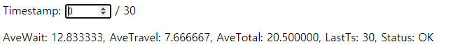
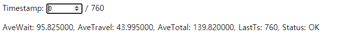
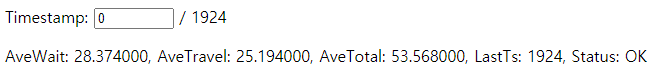

### 풀이과정
특별한 풀이는 아니지만 제가 구현한 방식은 다음과 같습니다.
1. 모든 엘레베이터는 탑승한 사람이나 외부에 탑승을 기다리는 사람과 관계없이 위 아래를 왕복합니다.
2. 엘레베이터가 탑승을 기다리는 사람과 같은 층 이면서 같은 진행방향일 경우에 탑승합니다.
3. 탑승한 사람의 내릴 지점에 엘리베이터가 도착하면 문을 열고 내려줍니다.

효율성을 고려하지 않은 방식이라 TimeStamp가 높게 나오지만 문제의 조건은 만족할 수 있었습니다.
### 결과

